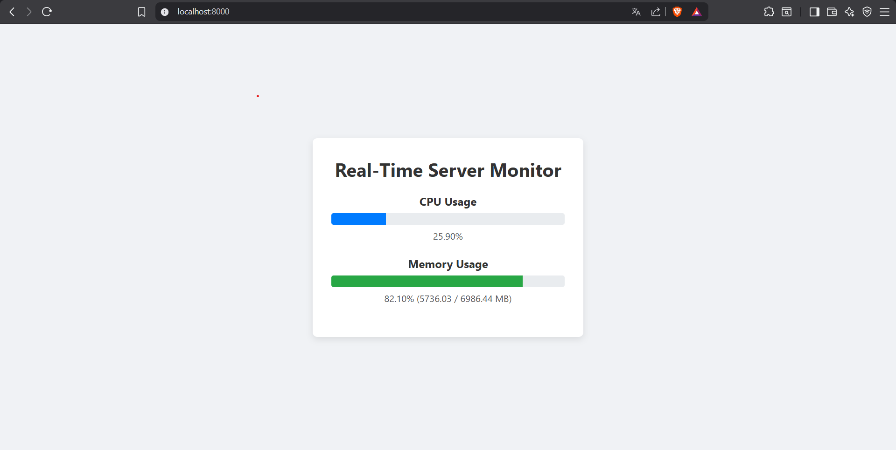

# FastAPI-SSE

A simple project to test how server Side Events (SSE) can be used in an app



## 📦 Installation

Clone the repo and install dependencies:

```bash
git clone https://github.com/SiandjaRemy/FastAPI-SSE.git
cd FastAPI-SSE
pip uv sync
```

## 🛠 Usage

Run the app:

```bash
uv run uvicorn main:app --reload
```

## ✨ Features

- Real-time like data (Data sent every 2 seconds and its adjustable).
- Ligthweight.
- No database.
- Simple frontend that displays machines performance.

## 🧰 Tech Stack

- Python 3.12
- FastAPI
- HTML & CSS

## 🙌 Credits

Inspired by the article written by [Thomas Reid](https://towardsdatascience.com/introducing-server-sent-events-in-python/)  
